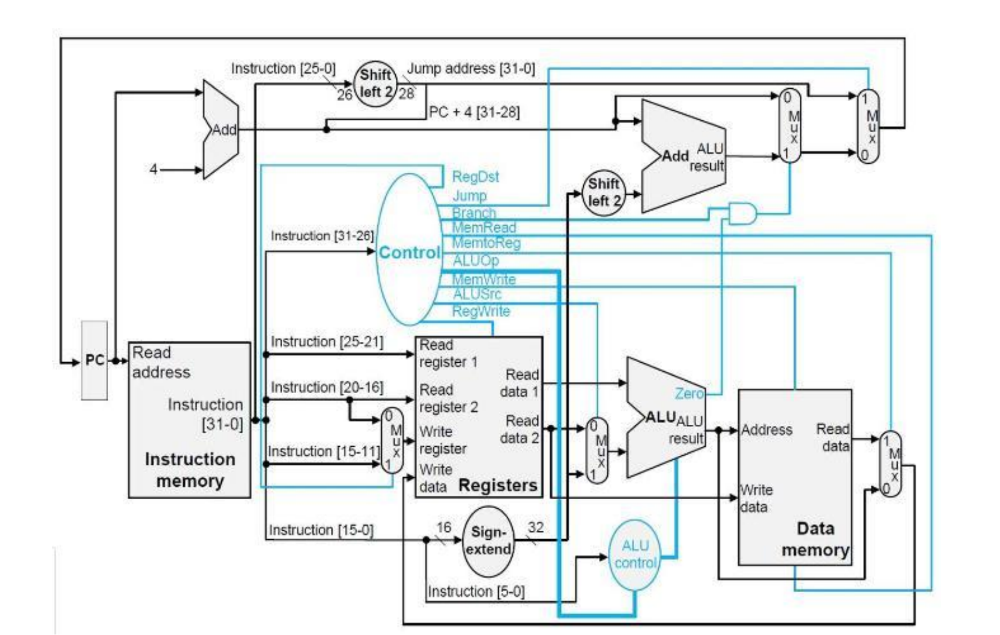
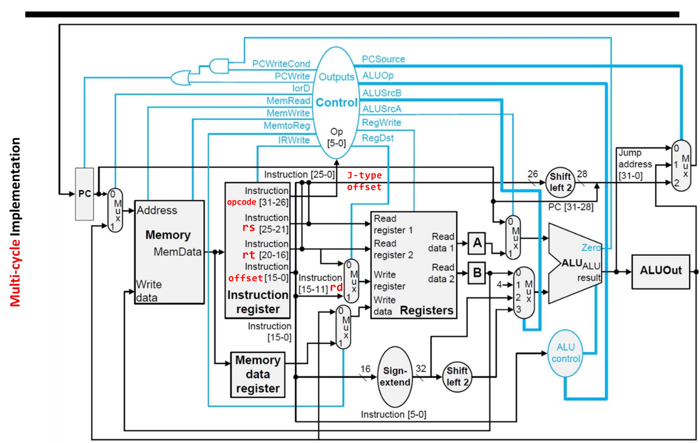
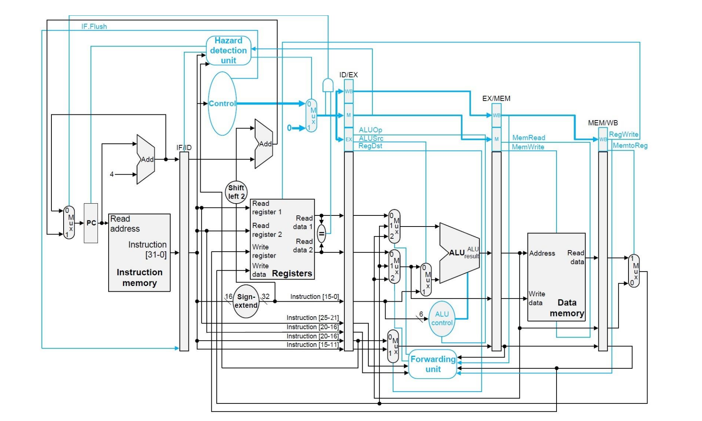

This repository contains implementations of a **MIPS32 processor** in three architectural styles:
-  **Single-Cycle**
-  **Multi-Cycle**
-  **Pipelined**
  
Each architecture simulates instruction execution using C++ and Code::Blocks.

## 🧬 Architecture Diagrams

###  Single-Cycle Architecture

###  Multi-Cycle Architecture

###  Pipelined Architecture

## Project Structure .
├── Single-Cycle/ # Single-cycle MIPS implementation
│ ├── src/ # Source files
│ ├── include/ # Header files
│ └── input.txt # Instruction input file
│
├── Multi-Cycle/ # Multi-cycle MIPS implementation
│ ├── src/
│ ├── include/
│ └── input.txt
│
├── Pipelined/ # Pipelined MIPS implementation
│ ├── src/
│ ├── include/
│ └── input.txt
│
└── Images/ # Architecture diagrams (PNG)

Αντιγραφή κώδικα

Each folder contains:
- `src/` → C++ source code
- `include/` → headers
- `input.txt` → sample input (e.g., MIPS instructions)
- `main.cpp` → entry point
- Code::Blocks project files (`*.cbp`, `*.layout`) *(excluded from GitHub)*

This project was developed as part of the **Computer Architecture Lab** during my Computer Engineering studies.

